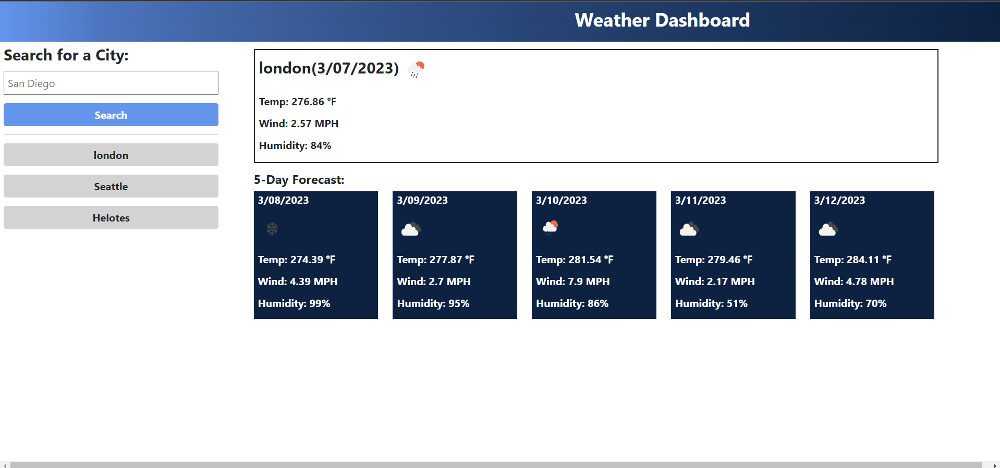

# serverSideAPIs-weatherDashboard

## Description

This is a weather-dashboard application. Users can check current weather condition and a 5-day weather forecast for a city.

## Installation

N/A

## Usage

* When users load the weather dashboard, an input area is displayed for them to search for a city.

* After users hit the search button, they are presented with current and future conditions (5-day forecast) for that city 
and that city is added to the search history.

* When users view current weather conditions for that city, they can see the city name, the date, an icon representation of weather conditions, the temperature, the humidity, and the wind speed.

* When users view future weather conditions for that city, they can see the date (for the next 5 days), an icon representation of weather conditions, the temperature, the wind speed, and the humidity.

* Users can click on a city in the search history to check weather conditions for that city again.

## Sreenshot

The following image demonstrates the application appearance:

## Link to the website

https://xybai0103.github.io/serverSideAPIs-weatherDashboard/

## Library used
* [jQuery](https://jquery.com/)
* [Day.js](https://day.js.org/en/)
* [Bootstrap](https://getbootstrap.com/)

## Credits

N/A

## Licencse

N/A